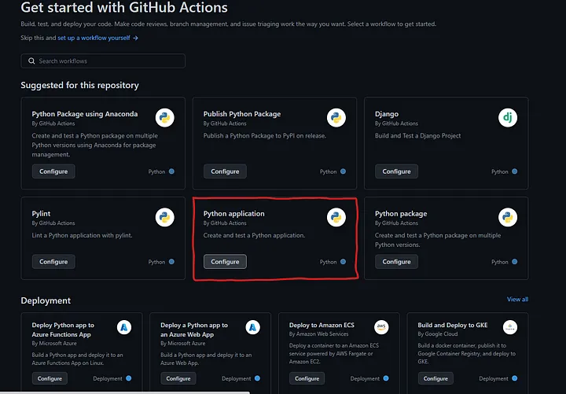

# Exercice 1 - Création du workflow d'action

## Objectifs

Cet exercice a pour objectifs de :

* Mettre en place le workflow
* Executer notre application Python 


## Un peu de vocabulaire :

* Flux de travail (workflow): un processus automatisé configurable qui exécutera un ou plusieurs emplois. Les flux de travail sont définis par un fichier YAML dans votre repo et s'exécuteront lorsqu'ils sont déclenchés par un événement dans votre repo. Ils peuvent également être déclenchés manuellement, ou avec un calendrier défini. Les flux de travail sont définis dans le .github/workflowsrépertoire dans un repo, et nous pouvons avoir plusieurs flux de travail par repo, chacun pouvant effectuer un ensemble de tâches différent.
* Événement: Une activité qui déclenche un flux de travail; ceux-ci peuvent être basés sur des événements tels que des requêtes push ou pull, mais ils peuvent également être programmés en utilisant la syntaxe crontab.
* Emploi (job): Une tâche dans un flux de travail unique. Un flux de travail peut comprendre un ou plusieurs emplois, et tous les emplois doivent être exécutés sans aucune erreur pour qu'un flux de travail soit réussi.
* Étape (step) : Une tâche plus petite qui est exécutée dans le cadre d'un emploi. Toutes les étapes doivent être accomplies pour mener à bien un travail.
* Action: Une commande autonome effectuée en une étape. Vous pouvez écrire vos propres actions, ou vous pouvez trouver des actions à utiliser dans vos flux de travail dans le GitHub Marketplace.
* Runner: Un serveur qui exécute vos flux de travail lorsqu'ils sont déclenchés. Chaque coureur peut faire un seul travail à la fois. GitHub fournit Ubuntu Linux, Microsoft Windows et macOS runners pour les flux de travail; chaque exécution de flux de travail s'exécute dans une nouvelle machine virtuelle nouvellement prévue.


## Forker un dépôt

* Créez vous un compte sur github et connectez vous : https://github.com
* Créez un fork du dépôt suivant : https://github.com/vanessakovalsky/python-api-handle-it (en cliquant sur le bouton Fork disponible en haut), cela crée un nouveau dépôt sur votre compte et copie le contenu du dépôt existant dans votre nouveau dépôt


## Initialiser le workflow 

* Nous allons ajouter un workflow, pour cela cliquer sur l'onglet Actions de votre dépôt 


* puis sur Nouveau Workflow



* Choisir alors Python application.

* Vous obtenez un fichier yaml comme celui-ci dessous

```
# This workflow will install Python dependencies, run tests and lint with a single version of Python
# For more information see: https://docs.github.com/en/actions/automating-builds-and-tests/building-and-testing-python

name: Python application

on:
  push:
    branches: [ "main" ]
  pull_request:
    branches: [ "main" ]

permissions:
  contents: read

jobs:
  build:

    runs-on: ubuntu-latest

    steps:
    - uses: actions/checkout@v3
    - name: Set up Python 3.10
      uses: actions/setup-python@v3
      with:
        python-version: "3.10"
    - name: Install dependencies
      run: |
        python -m pip install --upgrade pip
        pip install flake8 pytest
        if [ -f requirements.txt ]; then pip install -r requirements.txt; fi
    - name: Lint with flake8
      run: |
        # stop the build if there are Python syntax errors or undefined names
        flake8 . --count --select=E9,F63,F7,F82 --show-source --statistics
        # exit-zero treats all errors as warnings. The GitHub editor is 127 chars wide
        flake8 . --count --exit-zero --max-complexity=10 --max-line-length=127 --statistics
    - name: Test with pytest
      run: |
        pytest
```

* Une fois le fichier enregistré, (commit) vous pouvez allez dans Actions et voir votre pipeline s'exécuté.
