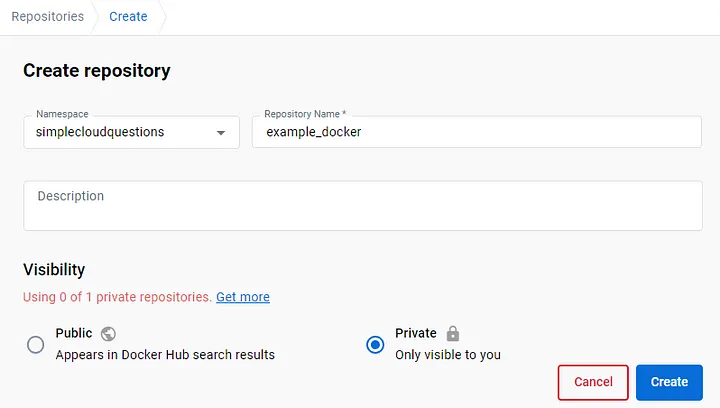
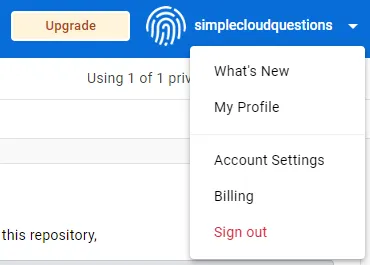

# Exercice 2 -  Construction d'une image docker et stockage de cette image

## Objectifs :

Cet exerice a pour objectifs de :

* Automatiser la construction d'une image docker
* La stocker sur le docker hub

## Mise en place du dépôt dans Docker Hub

* Créer un compte et Connectez-vous dans Docker Hub : https://hub.docker.com/
* Cliquez sur « Créer un dépôt »

* Maintenant, nous devons créer un jeton d'accès qui sera utilisé par le flux de travail Github pour pousser notre image docker vers Docker hub.

 * Allez à « Paramètres de compte », « Sécurité », « Nouveau jeton d'accès » et fournir une description du jeton d'accès.

* Vous recevrez un jeton d'accès personnel qui sera utilisé par des actions github

* Créer un autre secret de dépôt nommé DOCKERHUB_USERNAMEet insérez votre nom d'utilisateur Docker Hub.
